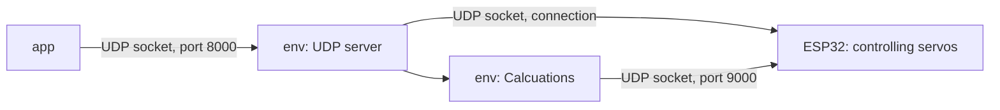

# robotNG

* The robot model was prepared in the 3DExperience software.
* Controlling the manipulator using an ESP32 microcontroller - communication over LAN network via a UDP server created
  as a docker compose.
* Controlling the robot through an application launched by the user, which then connects to the UDP server and ESP32
* By using dockers, each of modules are launched separately which results in easier to find a bug or core of a problem (
  similar to [ROS](https://www.ros.org/))

## Description of modules

|          | Short desc                                                                                  |
|----------|---------------------------------------------------------------------------------------------|
| app      | contain GUI (pygame) which connects with UDP Server Separate docker image                |
| env      | UDP server, manage received and sent brackets, calculate movement  Separate docker image |
| firmware | ESP32 module - connection with env (server UDP), control servos                             |
| hardware | Servos, connections on breadboard (later PCB), 3D model                                     |

## Dependencies

## Hardware

## UML diagram

Diagram showing simplified image of how structure works

